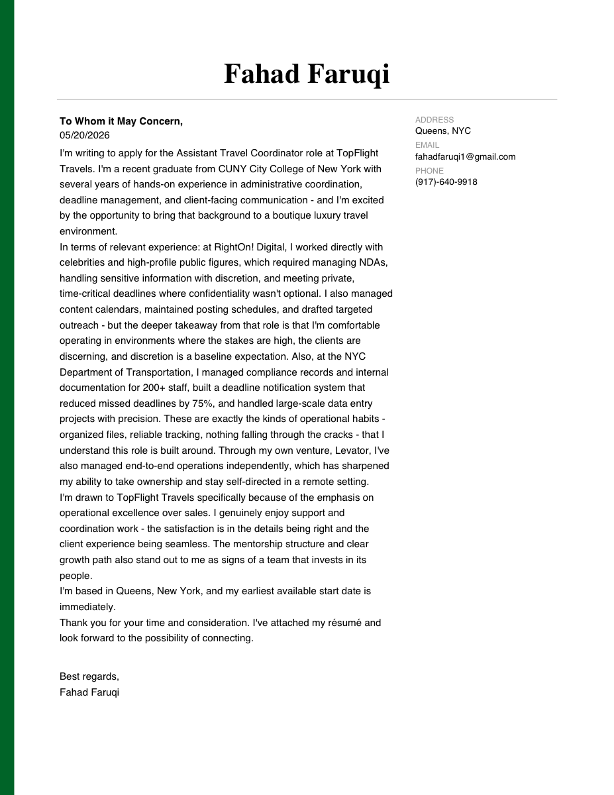

# Cover Letter Writer

Turn clipboard text into a formatted PDF cover letter. No typing into templates, no copy-paste into Word.



## What it does

1. Reads your contact info from a file
2. Reads cover letter text from your clipboard
3. Saves a styled PDF to your Downloads folder

## Setup

Create a file named `user.json` in the same folder as the app. Paste this in and fill in your details:

```json
{
  "name": "Your Name",
  "address": "Your City, State",
  "email": "you@example.com",
  "phone": "(555) 123-4567"
}
```

## How to use

1. Write or paste your cover letter body into any app (Notes, ChatGPT, etc)
2. Copy it to your clipboard
3. Run the app:
   - Double-click `cover-letter-writter` if you have the downloaded version
   - Or open Terminal, go to this folder, and run: `go run .`
4. Find `FahadFaruqiCoverLetter.pdf` in your Downloads folder

Done.
